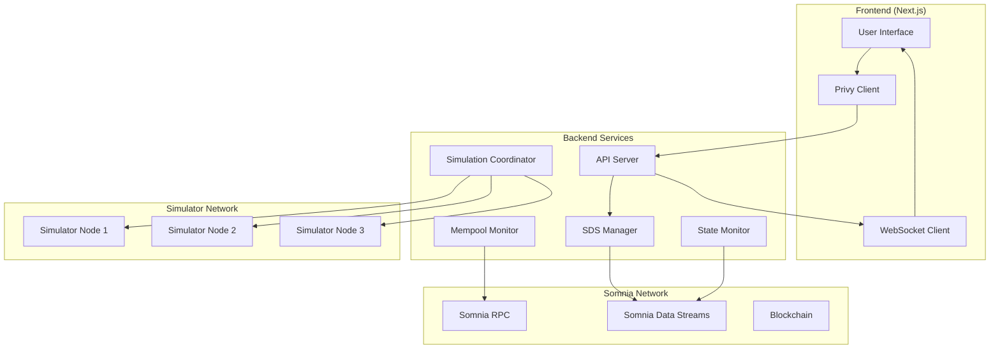

# Vigilant Security Protocol - Design Document

## Overview

Vigilant is a comprehensive Web3 security protocol that leverages Somnia's Data Streams SDK to provide real-time mempool monitoring, instant state change detection, and multi-node simulation consensus. The system protects users from front-running attacks, state manipulation, and malicious contract interactions through a sophisticated intent-based verification system.

## Architecture



## Components and Interfaces

### 1. Somnia Chain Configuration
- **Purpose**: Define Somnia testnet chain parameters for viem clients
- **Location**: `backend/lib/chain.ts`
- **Interface**: Exports `somniaTestnet` chain definition

### 2. Client Management
- **Purpose**: Create and manage viem public/wallet clients for Somnia network
- **Location**: `backend/lib/clients.ts`
- **Interface**: Exports `publicClient` and `walletClient` instances

### 3. Data Schemas
- **Purpose**: Define structured data formats for SDS streaming
- **Schemas**:
  - Intent Schema: Transaction intent data structure
  - Risk Schema: Risk assessment and threat data
  - Alert Schema: Real-time security alerts
- **Location**: `backend/lib/schemas.ts`

### 4. SDS Manager
- **Purpose**: Coordinate all Somnia Data Streams operations
- **Responsibilities**:
  - Schema registration and management
  - Real-time data publishing
  - Stream subscription handling
  - Event broadcasting
- **Location**: `backend/services/sds-manager.ts`

### 5. Mempool Monitor
- **Purpose**: Real-time mempool surveillance for threat detection
- **Responsibilities**:
  - Monitor pending transactions
  - Detect front-running attempts
  - Analyze gas price patterns
  - Generate threat alerts
- **Location**: `backend/services/mempool-monitor.ts`

### 6. State Monitor
- **Purpose**: Track blockchain state changes during verification
- **Responsibilities**:
  - Monitor contract storage changes
  - Detect event emissions
  - Trigger re-simulation on state changes
  - Maintain state snapshots
- **Location**: `backend/services/state-monitor.ts`

### 7. Simulation Coordinator
- **Purpose**: Manage multi-node transaction simulation
- **Responsibilities**:
  - Coordinate simulator nodes
  - Aggregate simulation results
  - Calculate consensus risk scores
  - Handle simulation failures
- **Location**: `backend/services/simulation-coordinator.ts`

### 8. Intent Manager
- **Purpose**: Handle transaction intent lifecycle
- **Responsibilities**:
  - Accept and validate intents
  - Track verification progress
  - Manage intent state transitions
  - Coordinate execution decisions
- **Location**: `backend/services/intent-manager.ts`

### 9. Privy Integration
- **Purpose**: Secure wallet connection and authentication
- **Components**:
  - Client-side wallet provider
  - Server-side JWT authentication
  - Wallet client creation utilities
- **Location**: `backend/lib/privy-integration.ts`

## Data Models

### Intent Model
```typescript
interface TransactionIntent {
  id: string;
  user: string;
  target: string;
  callData: string;
  value: bigint;
  timestamp: number;
  deadline: number;
  status: 'pending' | 'verifying' | 'approved' | 'blocked' | 'executed';
  stateSnapshot: string;
  riskScore: number;
  threats: ThreatData[];
}
```

### Risk Assessment Model
```typescript
interface RiskAssessment {
  intentId: string;
  simulatorId: string;
  riskScore: number;
  threats: ThreatData[];
  simulationResult: SimulationResult;
  timestamp: number;
}
```

### Threat Data Model
```typescript
interface ThreatData {
  type: 'front_running' | 'state_manipulation' | 'malicious_contract' | 'excessive_approval';
  severity: 'low' | 'medium' | 'high' | 'critical';
  description: string;
  evidence: any;
  confidence: number;
}
```

## Error Handling

### SDS Connection Errors
- Implement automatic reconnection with exponential backoff
- Fallback to polling mode if streaming fails
- Log connection issues for monitoring

### Simulation Failures
- Retry failed simulations with different nodes
- Treat persistent failures as maximum risk
- Maintain minimum simulator threshold

### State Change Conflicts
- Automatically trigger re-simulation on state changes
- Implement state lock mechanisms during verification
- Handle concurrent state modifications gracefully

### Network Connectivity
- Implement circuit breaker pattern for external calls
- Cache critical data for offline operation
- Provide degraded service during network issues

## Testing Strategy

### Unit Tests
- Test individual service components in isolation
- Mock external dependencies (Somnia RPC, SDS)
- Validate data transformation and business logic
- Test error handling and edge cases

### Integration Tests
- Test SDS streaming functionality end-to-end
- Validate mempool monitoring accuracy
- Test simulation coordination workflows
- Verify Privy wallet integration

### Performance Tests
- Measure SDS streaming latency and throughput
- Test system behavior under high transaction volume
- Validate sub-second alert propagation
- Monitor memory usage and resource consumption

### Security Tests
- Test intent validation and sanitization
- Verify threat detection accuracy
- Test authentication and authorization flows
- Validate data encryption and privacy protection